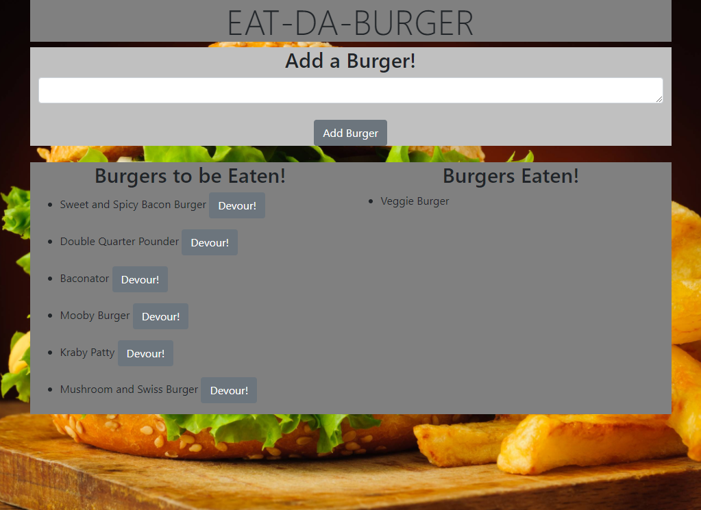

# Eat-da-Burger

## Table of Contents

* [Description](#description)
* [Installation](#installation)
* [Usage](#usage)
* [Credits](#credits)
* [License](#license)

## Description

Eat-da-Burger is an application that allows the user to keep track of burgers they want to eat. The user can also update another list to reflect which burgers they have eaten. Just add a new burger and then devour it!

## Installation

`npm install`

## Usage

`node server.js`

## Credits

[Node](https://nodejs.org/en/)

[Express](https://www.npmjs.com/package/express)

[Express Handlebars](https://www.npmjs.com/package/express-handlebars)

[MySQL](https://www.npmjs.com/package/mysql)

## License

[GNU General Public License v3.0](https://choosealicense.com/licenses/gpl-3.0/)